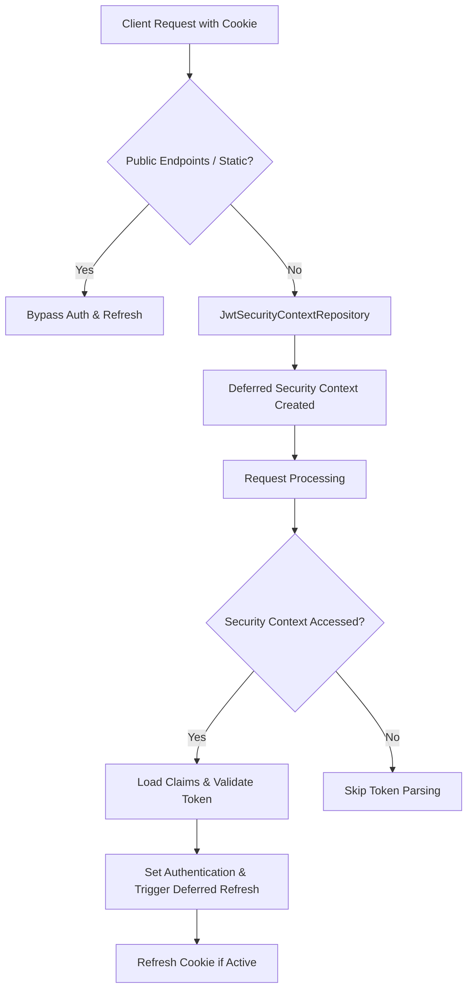

# Project Review: Stateless JWT Session Timeout & Activity-Based Refresh

## 1. Core Project Philosophy & Value Proposition

This project implements an **activity-based session timeout** mechanism using JSON Web Tokens (JWTs) stored in secure client-side cookies (`JSESSIONTOKEN`). 

In standard web applications, session timeout is typically handled in one of two ways:
1. **Stateful Session Tracking (Traditional)**: The server tracks session state in memory or a database (like Redis). While simple and secure (sessions can be revoked immediately), it requires shared state, hindering horizontal scaling.
2. **Stateless JWTs (Standard)**: The client stores a JWT that is valid for a fixed duration. While horizontally scalable and stateless, standard JWTs do not support "inactivity timeouts"—the session remains valid for the entire duration, and extending the session requires either long-lived tokens (security risk) or a stateful refresh token database.

### The Hybrid Solution
This project seeks a **best-of-both-worlds hybrid approach**:
* **Stateless horizontal scalability**: All session metadata (session start time, last activity time) is stored inside the JWT claims. No database or cache lookup is required on the server to validate or update the session.
* **Inactivity timeout support**: By tracking `lastActivity` in the token claims and writing back refreshed cookies when the user is active, the application dynamically extends the user's session in response to their activity.
* **Maximum session life**: A hard limit (`jwt.max-session-duration`) ensures that even highly active users must re-authenticate after a certain time, mitigating risks from stolen cookies.
* **Secure Storage**: Cookies are configured with `HttpOnly`, `Secure`, and `SameSite=Lax`, protecting the token from cross-site scripting (XSS) extraction.

---

## 2. Key Components & Implementation Mechanics

The architecture is composed of several custom integrations with **Spring Security 6**:



### Critical Analysis of Components
1. **`JwtProperties`**: Centralizes timeouts. Uses separate durations for access token life (`jwt.expiration`), inactivity timeout (`jwt.inactivity-timeout`), and maximum session life (`jwt.max-session-duration`).
2. **`JwtSecurityContextRepository` & `JwtDeferredSecurityContext`**:
   * Uses Spring Security 6's new deferred/lazy loading model.
   * Resolving authentication is deferred until it is actually required (e.g., when reaching authorization checks). This prevents unnecessary cryptography and parsing for non-authenticated endpoints.
3. **`RequestCacheBuilder`**: Prevents state leaks and loops on authentication failures, specifically excluding AJAX requests and forward dispatches.

---

## 3. Critical Findings & Security Bugs

While the project idea is strong, the current implementation has several critical issues that compromise the security and efficiency of the system:

### 🚨 Major Bug: Inactivity Timeout is Not Enforced
**Problem:** A user who is inactive past the inactivity timeout threshold can still successfully authenticate.

**Explanation:**
* In `JwtSecurityContextRepository.getContext`, the token validation is delegated to `jwtTokenProvider.isValid(claims)`:
  ```java
  JwtCookie.readToken(request)
      .flatMap(jwtTokenProvider::getClaimsFromToken)
      .filter(jwtTokenProvider::isValid) // <-- Checks expiration and max duration ONLY
      .ifPresent(claims -> { ... });
  ```
* `JwtTokenProvider.isValid` does not verify if the `inactivityTimeout` has been exceeded:
  ```java
  public boolean isValid(Claims claims) {
      Instant now = Instant.now();
      return claims != null
          && claims.getExpiration() != null
          && claims.getExpiration().after(Date.from(now))
          && !isSessionExpired(claims); // <-- Only checks max session duration
  }
  ```
* Consequently, if `jwt.expiration` is 15 minutes and `jwt.inactivity-timeout` is 10 minutes:
  * A user waits 12 minutes (inactive).
  * The user makes a request.
  * The token has not expired (12 < 15) and max session limit is not hit.
  * `isValid` returns `true`, and the user is authenticated.
  * In `JwtDeferredSecurityContext`, `shouldRefreshToken` returns `false` (because 12 minutes > 10 minutes).
  * However, **the request still proceeds successfully**. The session is not blocked or invalidated.

**Fix:** The inactivity check must be part of the primary token validation logic in `isValid(claims)` or within `getContext` before authenticating.

---

### ⚠️ Performance Issue: Token Churn (Over-Refreshing)
**Problem:** A new JWT is generated, signed, and sent as a cookie header on *every single request* within the activity window.

**Explanation:**
* In `shouldRefreshToken`:
  ```java
  public boolean shouldRefreshToken(Claims claims, long inactivityTimeoutSeconds) {
      ...
      long inactivityDuration = now - lastActivity;
      return inactivityDuration < inactivityTimeoutSeconds && isValid(claims);
  }
  ```
* Because `lastActivity` is reset to `now` upon refresh, any subsequent request will have `inactivityDuration` close to 0. Since 0 is less than `inactivityTimeoutSeconds`, the condition is met, and a new token is generated.
* Generating a new cryptographically signed token and updating cookie headers on every HTTP request adds significant CPU overhead and response size overhead.

**Fix (Debounce Strategy):** Refresh the token only after a substantial fraction of the inactivity window has passed (e.g., after 5 minutes of a 10-minute inactivity window have elapsed):
```java
long halfInactivityWindow = inactivityTimeoutSeconds / 2;
return inactivityDuration >= halfInactivityWindow && inactivityDuration < inactivityTimeoutSeconds && isValid(claims);
```

---

### 🔍 Configuration Redundancy: Duplicate Refresh Filters
**Problem:** The project contains both `JwtTokenRefreshFilter` and `JwtDeferredSecurityContext.handleTokenRefreshIfNeeded()`.

**Explanation:**
* `JwtTokenRefreshFilter` is registered as a Spring bean (`@Component`), running globally on all requests.
* `JwtDeferredSecurityContext` has its own refresh logic running when Spring Security evaluates the security context.
* Having both logic blocks executes redundant cookie writes, potentially conflicts, and defeats the purpose of the lazy/deferred context loading (since the filter accesses the claims anyway, resolving the deferred lookup eagerly).

**Fix:** Consolidate the token refresh logic. Since Spring Security uses the deferred context, it is cleaner to keep the refresh execution inside the deferred repository pipeline and remove the standalone global servlet filter.

---

## 4. Recommendations for Production Readiness

To turn this prototype/idea into a robust, enterprise-grade architecture, we recommend:
1. **Fix Inactivity Invalidation**: Ensure that requests with tokens older than the inactivity window are rejected immediately.
2. **Apply Debounce Logic**: Implement a token refresh threshold to avoid signing new tokens on every request.
3. **Clean Up Filter Duplication**: Remove the unused/redundant filter to ensure context retrieval remains deferred.
4. **Token Revocation Check (Optional hybrid feature)**: Consider adding a blacklisting store (e.g., a lightweight Redis set) for invalidating tokens early if immediate logout capability is required.
